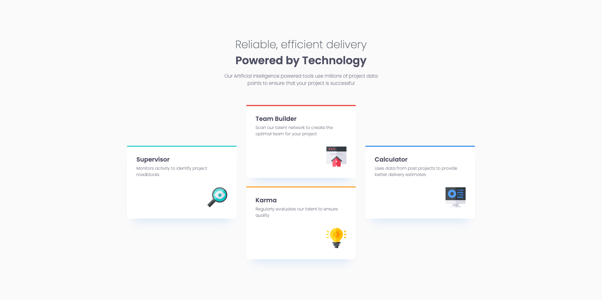

# Frontend Mentor - Four card feature section solution

This is a solution to the [Four card feature section challenge on Frontend Mentor](https://www.frontendmentor.io/challenges/four-card-feature-section-weK1eFYK). Frontend Mentor challenges help you improve your coding skills by building realistic projects. 

## Table of contents

- [Frontend Mentor - Four card feature section solution](#frontend-mentor---four-card-feature-section-solution)
  - [Table of contents](#table-of-contents)
  - [Overview](#overview)
    - [The challenge](#the-challenge)
    - [Screenshot](#screenshot)
    - [Links](#links)
  - [My process](#my-process)
    - [Built with](#built-with)
    - [What I learned](#what-i-learned)
    - [Continued development](#continued-development)
    - [Useful resources](#useful-resources)
  - [Author](#author)

## Overview

### The challenge

Users should be able to:

- View the optimal layout for the site depending on their device's screen size

### Screenshot

### Links

- Solution URL: [Add solution URL here](https://github.com/AlexanderTejedor/Four-card-feature-section)
- Live Site URL: [Add live site URL here](https://alexandertejedor.github.io/Four-card-feature-section/)

## My process

### Built with

- Semantic HTML5 markup
- CSS custom properties
- Flexbox
- CSS Grid
- Mobile-first workflow

### What I learned

Overall, a very fun challenge, it helped me continue reinforcing my skills!

### Continued development

I would like to continue applying this knowledge to complete future challenges and even future projects.

### Useful resources

- [Google Fonts](https://fonts.google.com/) - This helped me to use external fonts instead of local ones, so that everyone can identify the type of font I used for this challenge.

## Author

- Website - [Alexander Tejedor](https://github.com/AlexanderTejedor)
- Frontend Mentor - [@AlexanderTejedor](https://www.frontendmentor.io/profile/AlexanderTejedor)
- Twitter - [@Alexand59894016](https://x.com/Alexand59894016)
- Instagram - [_.alexDev._](https://www.instagram.com/_.alexdev._/?hl=es)
